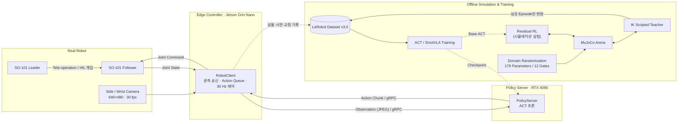
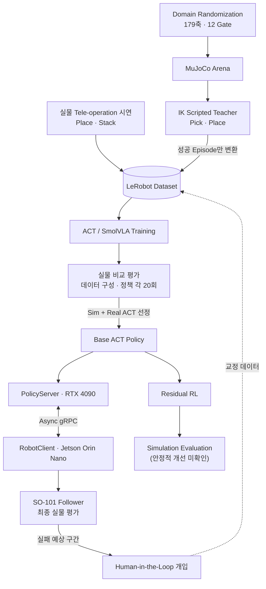
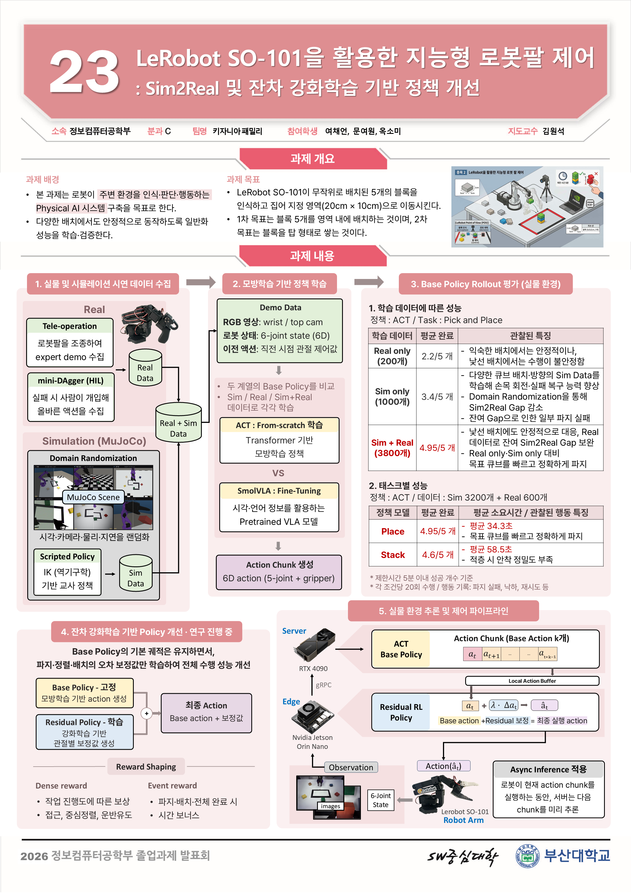

# LeRobot SO-101을 활용한 지능형 로봇팔 제어 : Sim2Real 및 잔차 강화학습 기반 정책 개선

> **2026 전기 Physical AI 졸업과제 · 23팀 키자니아패밀리**  
> Pusan National University, Computer Science and Engineering

본 프로젝트는 **LeRobot SO-101 로봇팔**을 대상으로 시각 관측, 데이터 수집 및 생성, 정책 학습, 비동기 서버 추론, 실제 로봇 제어까지 이어지는 **End-to-End Physical AI 파이프라인**을 구축하는 것을 목표로 한다.

주요 과제는 무작위로 배치된 5개의 블록을 지정 영역으로 옮기는 **Pick & Place**와 블록을 순차적으로 쌓는 **Pick & Stack**이다.

단순한 사전 정의 경로를 재생하는 방식이 아니라 Side/Wrist 카메라 영상과 로봇 상태를 입력으로 받아 학습된 정책이 현재 상황에 맞는 행동을 생성하도록 설계하였다.

| 최종 결과 (실물, 미션별 20회, 제한 5분) | 평균 완료 |
|---|---|
| Pick & Place | **4.95 / 5개** |
| Pick & Stack | **4.6 / 5개** |

두 미션을 **하나의 task-conditioned ACT**로 수행하였다. 학습 데이터는 시뮬레이션 Pick·Place와 실물 Place·Stack 시연을 합친 3,910 Episode이다.

---

# 1. 프로젝트 배경

## 1.1. Physical AI 기술 동향 및 로봇 조작의 과제

최근 로봇 연구는 정해진 좌표와 경로를 반복하는 자동화에서 벗어나, 카메라와 센서로 실제 환경을 인식하고 상황에 맞는 행동을 생성하는 **Physical AI 기반 로봇 제어**로 확장되고 있다.

Physical AI는 인공지능이 디지털 환경에 머무르지 않고 카메라와 센서를 통해 물리 환경을 인식하고, 로봇과 같은 실제 하드웨어를 제어하여 행동까지 수행하는 기술을 의미한다. 특히 로봇 조작 분야에서는 시각 정보를 기반으로 물체의 위치와 상태를 파악하고, 학습된 정책을 이용해 Pick & Place, 적재, 조립과 같은 복잡한 작업을 수행하는 방향으로 발전하고 있다.

그러나 학습 기반 로봇 조작을 실제 환경에 적용하기 위해서는 다음과 같은 문제를 해결해야 한다.

### 1. 실물 데이터 수집 비용

모방학습 기반 로봇 정책은 사람이 직접 수행한 시연 데이터를 통해 행동을 학습한다. 하지만 다양한 물체 위치와 실패 상황을 포함하는 충분한 데이터를 실제 로봇에서 수집하려면 많은 시간과 반복 작업이 필요하다.

### 2. Sim-to-Real Gap

시뮬레이션을 활용하면 대규모 데이터를 자동으로 생성할 수 있지만, 시뮬레이션과 실제 환경 사이에는 카메라 위치와 영상 특성, 조명, 로봇 동역학, 관절 오차, 통신 지연 등 다양한 차이가 존재한다. 따라서 시뮬레이션에서 높은 성능을 보인 정책이 실제 로봇에서도 동일하게 동작한다는 보장이 없다.

### 3. 학습 데이터 밖의 상태에 대한 취약성

모방학습 정책은 주로 성공적인 시연 궤적을 학습하기 때문에 실행 중 파지에 실패하거나 물체를 놓치는 등 학습 데이터에 충분히 포함되지 않은 상태에 진입하면 오류가 누적될 수 있다. 특히 여러 개의 물체를 연속으로 조작하는 장기 작업에서는 작은 실패가 이후 전체 작업의 실패로 이어질 수 있다.

### 4. 실제 로봇 환경의 불확실성

실제 로봇에서는 관절 유격, 조립 오차, 카메라 위치 변화, 조명 변화와 같이 시뮬레이션에서 정확하게 모델링하기 어려운 요소가 존재한다. 동일한 명령을 실행하더라도 실제 End-effector의 위치가 조금씩 달라질 수 있어 정밀한 파지 작업에서는 이러한 차이가 성능에 직접적인 영향을 미친다.

### 5. 실시간 추론 및 시스템 제약

Vision 기반 로봇 정책은 카메라 영상과 로봇 상태를 지속적으로 처리해야 하므로 높은 연산량을 요구한다. 엣지 장치에서 모든 추론을 수행하기 어려운 경우 외부 GPU 서버를 활용해야 하지만, 이 경우 영상 전송과 정책 추론 과정에서 발생하는 네트워크 지연을 고려하면서도 로봇의 제어 주기를 안정적으로 유지해야 한다.

본 프로젝트는 이러한 Physical AI 기반 로봇 조작의 문제를 대상으로 **실물 데이터와 시뮬레이션 데이터의 결합, Domain Randomization, Human-in-the-Loop 교정 데이터 수집, 비동기 서버 추론, Residual Reinforcement Learning**을 적용하고, 이를 실제 **LeRobot SO-101** 로봇팔에서 검증하는 것을 목표로 한다.

---

## 1.2. 필요성과 기대효과

본 프로젝트는 위 문제를 해결하기 위해 다음 기술을 하나의 로봇 제어 시스템 안에서 통합하였다.

- **데이터 수집 및 강화학습을 위한 Simulation 환경 구축**
- **Real + Simulation 데이터 혼합 학습**
- **Domain Randomization**
- **Human-in-the-Loop 교정 데이터 수집**
- **Asynchronous Inference**
- **Residual Reinforcement Learning**

특히 MuJoCo 시뮬레이터에 실제 경기장과 SO-101 환경을 구축하고, **179개의 랜덤화 파라미터를 12개의 Gate로 관리**하여 카메라 기하, 조명, 재질, 센서 노이즈, 로봇 동역학, 관절 오차 등 다양한 환경 변화를 데이터에 반영하였다.

이를 통해 다음과 같은 효과를 기대할 수 있다.

1. 시뮬레이션 기반 대규모 데이터 생성을 통한 실물 데이터 수집 부담 감소
2. 다양한 초기 위치와 환경 변화에 강인한 로봇 조작 정책 개발
3. Real + Sim 혼합 학습을 통한 Sim-to-Real Gap 완화
4. 실패 직전 상태와 복구 행동을 포함한 정책 학습
5. 엣지 로봇과 GPU 서버를 분리한 실제 배포 가능한 추론 구조 구축
6. Pick & Place에서 Pick & Stack 및 범용 로봇 조작으로 확장 가능한 연구 기반 확보

---

# 2. 개발 목표

## 2.1. 목표 및 세부 내용

본 프로젝트의 목표는 LeRobot SO-101 로봇팔이 카메라 관측을 기반으로
임의 위치의 블록을 인식하고, Pick & Place 및 Pick & Stack 작업을 수행할 수 있는
학습 기반 로봇 제어 시스템을 구축하는 것이다.

### 주요 개발 내용

- SO-101 Leader–Follower 기반 실물 시연 데이터 수집
- MuJoCo 기반 SO-101 및 경기장 시뮬레이션 환경 구축
- IK 기반 Scripted Teacher를 이용한 시뮬레이션 데이터 자동 생성
- Domain Randomization을 통한 Sim-to-Real Gap 완화
- ACT 및 SmolVLA 기반 모방학습 정책 학습 및 비교
- Real / Sim / Sim + Real 데이터 구성에 따른 실제 로봇 성능 비교
- Human-in-the-Loop 기반 실패 상태 및 복구 데이터 수집
- Jetson Orin Nano와 GPU 서버 간 비동기 정책 추론 시스템 구축
- ACT Base Policy의 동작을 보정하기 위한 Residual Reinforcement Learning 실험
- Pick & Place와 Pick & Stack을 하나의 정책으로 통합하기 위한 Task Conditioning

### 수행 미션

과제 요구조건 기준이다. 블록은 색이 다른 4×4×2 cm 5개, 지정 영역은 내부 기준 20×10 cm이며 로봇 끝에서 25 cm 지점에 둔다.

| Mission | 목표 | 제한 시간 |
|---|---|---|
| **Pick & Place** | 임의 배치된 블록 5개를 SO-101로 집어 지정 영역 내부로 이동 | 5분 |
| **Pick & Stack** | 임의 배치된 블록 5개를 지정 영역 내부에 순차적으로 적재, 5초 이상 유지 시 성공 | 5분 |
| **Multi-task Policy** | 두 미션을 **하나의 신경망 모델**로 수행 (Task Condition으로 구분) | — |

---

## 2.2. 핵심 기술 및 개발 방향

본 프로젝트는 실제 로봇에서 수집한 데이터만으로 정책을 학습하는 방식의 한계를 보완하고,
시뮬레이션에서 생성한 데이터를 실제 로봇 학습에 활용할 수 있는
Sim-to-Real 기반 로봇 학습 파이프라인을 구축하는 데 중점을 두었다.

| 기존 접근 방식 | 한계 | 본 프로젝트 |
|---|---|---|
| 고정 경로 / Rule-based | 위치 변화에 취약 | Vision 기반 정책으로 상태에 따른 행동 생성 |
| Real-only Imitation Learning | 데이터 다양성 확보 어려움 | Real + Sim 혼합 학습 |
| Sim-only Learning | Sim-to-Real Gap | 실제 환경 보정 + Domain Randomization |
| 성공 시연 중심 학습 | 실패 후 복구 어려움 | HIL 및 Scripted Teacher Recovery |
| Edge 단독 추론 | 연산 자원 한계 | Orin–GPU Server Async Inference |
| 정책 전체 Fine-tuning | 기존 정책 성능 훼손 가능 | Base Policy + bounded Residual RL 연구 |

### Real + Simulation 데이터 활용

실물 로봇에서는 높은 현실성을 가진 데이터를 얻을 수 있지만,
다양한 초기 상태와 실패 상황을 반복적으로 수집하는 데 많은 시간이 필요하다.

이를 보완하기 위해 MuJoCo에서 실제 SO-101 로봇과 경기장을 재현하고,
IK 기반 Scripted Teacher를 통해 대규모 시뮬레이션 데이터를 자동 생성하였다.

최종적으로 Real-only, Sim-only, Sim + Real 데이터로 각각 ACT를 학습하여
실제 로봇에서 성능을 비교하였다. (Pick & Place, 조건별 20회, 배치 수 기준)

| 학습 데이터 | 실제 로봇 평균 배치 수 | 관찰 |
|---|---:|---|
| Real Only (170) | 2.2 / 5 | 익숙한 배치에서는 안정적이나 낯선 배치에서 불안정 |
| Sim Only (1,000) | 2.3 / 5 | 낯선 배치에서도 손목 회전·복구는 좋아졌으나 관절 유격 등으로 실물 파지 실패 |
| **Sim + Real (1,170)** | **3.4 / 5** | 세 조합 중 가장 안정적. 첫 파지 실패가 전체 실패로 이어지는 경우가 남음 |

조건 간에 같은 초기 배치를 짝지어 썼는지와 학습 시드 반복 여부는 기록되지 않아, 위 결과는 해당 평가 조건에서의 관찰로 해석한다.

### Domain Randomization을 통한 Sim-to-Real 대응

시뮬레이션과 실제 환경 사이의 차이를 줄이기 위해
카메라, 조명, 재질, 로봇 동역학, 센서 및 관절 오차 등
다양한 요소에 Domain Randomization을 적용하였다.

총 179개의 랜덤화 파라미터를 12개의 Gate로 구성하여
다양한 환경에서 학습 데이터를 생성할 수 있도록 설계하였다. Gate별 구성은 [4.2.1절](#421-simulation-data-generation)에 정리하였다.

<p align="center">
  
</p>

### 실패 상태와 복구 행동 학습

성공 시연 중심의 모방학습 데이터만으로는
정책이 예상하지 못한 상태에 진입했을 때 복구 행동을 학습하기 어렵다.

이를 보완하기 위해 시뮬레이션 데이터 생성 과정에
불규칙한 초기 상태와 파지 실패 이후의 복구 궤적을 포함하였으며,
실물 환경에서는 Human-in-the-Loop 방식으로
정책 실행 중 사람이 필요한 순간에 개입하여 교정 데이터를 수집할 수 있도록 구현하였다.

### 실제 로봇을 위한 비동기 추론 구조

정책 추론과 로봇 제어를 하나의 장치에서 수행하는 대신,
Jetson Orin Nano는 카메라 관측 및 로봇 제어를 담당하고
RTX 4090 GPU 서버가 정책 추론을 담당하도록 시스템을 분리하였다.

RobotClient와 PolicyServer는 gRPC를 통해 통신하며,
정책 서버의 응답을 매 제어 주기마다 기다리지 않고
기존에 전달받은 Action Chunk를 실행하는 비동기 추론 방식을 적용하였다.

### 모방학습 정책의 추가적인 성능 개선 탐색 - 잔차 강화학습

ACT로 학습된 Base Policy 전체를 다시 학습하는 대신,
Base Action에 작은 보정값을 추가하는 Residual Reinforcement Learning을 실험하였다.

다양한 Reward, Residual Scale, Exploration 설정 등을 실험하였으나
최종적으로 Base Policy를 안정적으로 능가하는 성능 향상은 확인하지 못하였다.

따라서 Residual RL은 본 프로젝트에서 성능 개선이 완료된 방법이 아니라,
모방학습 정책의 실패를 강화학습으로 보정할 수 있는지를 검증한
후속 연구 방향으로 정리하였다.

---

## 2.3. 기대효과 및 확장 방향

<!-- TODO : 학교 템플릿의 2.3 제목은 "사회적 가치 도입 계획"(공공성, 지속 가능성, 환경 보호 등)이다. 아래는 기대효과·산업 적용 위주라 공공성/지속 가능성 관점 한두 문단을 팀에서 보강할지 정할 것 -->

본 프로젝트는 Physical AI 연구를 실제 로봇 시스템에 적용할 수 있는 **재현 가능한 데이터 생성·학습·제어 파이프라인**을 구축하는 것을 지향한다.

시뮬레이션 기반 데이터 생성은 모든 학습 데이터를 실제 로봇으로 반복 수집해야 하는 부담을 줄일 수 있으며, 실제 장비를 사용하기 전에 다양한 환경 변화와 실패 상황을 안전하게 검증할 수 있다.

데이터 생성부터 학습, Sim-to-Real 전이, 실제 로봇 추론 및 평가까지의 전체 파이프라인은 향후 더 다양한 로봇 조작 작업으로 확장할 수 있다. 교육 및 연구용 SO-101 플랫폼에서 검증한 기술을 기반으로 다음과 같은 산업 현장의 Manipulation 문제에도 적용 가능성을 탐색할 수 있다.

- 물류 환경에서의 물체 이송 및 **Pick & Place**
- 비전 기반 **제품 분류 및 정렬**
- 부품 배치 및 **조립 작업**
- 반복적인 **산업용 Manipulation**
- 다양한 물체와 환경에 대응하는 **범용 로봇 조작**
- 사람과 작업 공간을 공유하는 **지능형 협업 로봇 시스템**

향후에는 현재 구축한 시스템을 기반으로 **Human-in-the-Loop 교정 데이터 확대**, **실패 상태 중심의 Recovery Policy 학습**, **Residual RL을 활용한 정밀 조작 성능 개선** 등을 진행할 수 있다. 더 나아가 Vision-Language-Action 모델을 활용한 Task Conditioning과 다양한 물체 및 환경을 대상으로 한 Sim-to-Real 일반화로 연구 범위를 확장할 수 있다.

---

# 3. 시스템 설계

## 3.1. 시스템 구성도

전체 시스템은 크게 다음 네 영역으로 구성된다. MuJoCo는 실물 제어 경로에 들어가지 않고 데이터 생성과 정책 검증만 담당한다.

1. **Real Robot** : SO-101 Follower, Side/Wrist 카메라, 시연 수집용 Leader Arm
2. **Edge Controller** : Jetson Orin Nano의 RobotClient
3. **Policy Server** : RTX 4090 PC의 PolicyServer
4. **Offline Simulation & Training** : MuJoCo 데이터 생성, 정책 학습, Residual RL (공용 GPU 서버)



Jetson Orin Nano는 카메라 및 관절 상태를 수집하고 Action Queue를 관리하며 **30 Hz**로 로봇을 제어한다. 관측 업로드는 별도 워커 스레드에서 처리해 제어 주기를 막지 않는다.

실제 정책 추론은 RTX 4090이 탑재된 Policy Server에서 수행하며, 두 장치는 **gRPC**를 통해 비동기적으로 통신한다.

실물 데이터와 시뮬레이션 데이터는 같은 스키마(LeRobot Dataset v3.0, 30 fps)를 사용하므로 하나의 학습 파이프라인에 함께 넣을 수 있다.

| 키 | 개별 미션 정책 | 멀티태스크 확장 |
|---|---|---|
| `observation.images.side` | 480×640 RGB | 동일 |
| `observation.images.wrist` | 480×640 RGB | 동일 |
| `observation.state` | 관절 5축 + 그리퍼 = 6차원 | 6차원 + Task One-hot 2차원 = 8차원 |
| `action` | 관절·그리퍼 목표 6차원 | 동일 |

---

## 3.2. 사용 기술

### Hardware

| Category | Technology |
|---|---|
| Robot | LeRobot SO-101 Leader / Follower (STS3215 서보 6축) |
| Camera | Side Camera, Wrist Camera |
| Edge Device | NVIDIA Jetson Orin Nano (추론하지 않음) |
| Inference Server | NVIDIA RTX 4090 24GB |
| Training Server | 공용 GPU 서버 (RTX 4090 × 8) |

### Software

| Category | Technology |
|---|---|
| OS | Ubuntu Linux |
| Language | Python 3.12 |
| Robot Framework | Hugging Face LeRobot |
| Deep Learning | PyTorch ≥ 2.4 |
| GPU | CUDA 12.8 |
| Simulation | MuJoCo ≥ 3.2 |
| Computer Vision | OpenCV |
| Dataset | LeRobot Dataset v3.0 |
| Dataset Storage | Hugging Face Hub |
| Communication | gRPC |
| Imitation Learning | ACT, SmolVLA |
| Reinforcement Learning | Custom Residual RL |
| Async Inference | LeRobot Async Inference |
| Video Encoding | AV1 / libsvtav1 |
| Package Manager | uv |
| Testing | pytest, custom validation scripts |

### Camera

| Camera | Resolution | FPS | Role |
|---|---:|---:|---|
| Side Camera | 640×480 | 30 fps | 경기장 정면 상단에서 비스듬히 내려다보며 전체 블록 위치 관측 |
| Wrist Camera | 640×480 | 30 fps | 그리퍼 주변 근접 관측 |

---

# 4. 개발 결과

## 4.1. 전체 시스템 흐름도



<!-- TODO : HIL 교정 데이터가 최종 학습 데이터의 실물 Place·Stack에 실제로 들어갔는지 팀에 확인할 것. 안 들어갔다면 위 "교정 데이터" 점선은 수집 경로만 뜻한다고 문장으로 밝혀 둘 것 -->

전체 시스템은 다음 과정으로 동작한다.

```text
Real Data Collection (Tele-operation)
      ↓
Simulation Data Generation (IK Teacher + Domain Randomization)
      ↓
Offline Policy Training (Real / Sim / Sim + Real)
      ↓
Real Robot Evaluation (데이터 구성 · 정책 비교)
      ↓
Failure Analysis
      ↓
Corrective Data (HIL) / Policy Improvement (Residual RL)
      ↓
Async Real-Robot Deployment
```

---

## 4.2. 기능 설명 및 주요 기능 명세서

| 기능 | 입력 | 출력 | 설명 |
|---|---|---|---|
| Tele-operation Data Collection | Leader Arm, Camera Image | LeRobot Episode | Leader–Follower 방식의 실물 시연 수집 |
| MuJoCo Simulation | Robot / Block State | Simulation Observation | 실제 경기장을 보정한 SO-101 환경 |
| IK Scripted Teacher | Block Position / Pose | Expert Trajectory | IK 기반 Pick & Place / Stack 궤적 생성 |
| Domain Randomization | Simulation Parameters | Randomized Episode | 179개 파라미터를 12개 Gate로 관리 |
| ACT Training | LeRobot Dataset | Policy Checkpoint | Action Chunk 예측 정책 |
| SmolVLA Training | LeRobot Dataset | Policy Checkpoint | Pretrained VLA 기반 Fine-tuning |
| HIL Collection | Policy + Human Intervention | Corrective Episode | 실패 예상 구간에서 사람의 복구 행동 수집 |
| Async Inference | Camera + Joint State | Action Chunk | Jetson ↔ RTX 4090 비동기 추론 |
| Residual RL | Base Action + Observation | Corrected Action | ACT 행동에 제한된 Residual Action 추가 |
| Task Conditioning | Joint State + Task ID | Robot Action | 하나의 정책으로 Place / Stack 구분 |

---

### 4.2.1. Simulation Data Generation

시뮬레이션에서는 MuJoCo 환경에서 **IK 기반 Scripted Teacher**가 로봇을 제어하여 시연 데이터를 자동 생성한다. 교사는 블록의 위치·자세를 직접 읽어 궤적을 만들고, 데이터셋에는 카메라 영상·관절 상태·action만 저장한다. 전체 Domain Randomization 조건에서 Pick & Place 교사 성공률은 **0.933**이다.

성공 기준을 만족한 Episode만 LeRobot Dataset 형식으로 변환하여 학습 데이터로 사용하였다.

최종 Pick & Place 시뮬레이션 데이터셋은 다음과 같이 구성하였다.

- 전체 Domain Randomization 적용 (12개 Gate 모두 활성화)
- 일반 시작 상태 700 Episode, 불규칙·실패 복구 시작 300 Episode를 목표로 구성
  - 불규칙 시작: 지정 영역에 블록 2~4개가 이미 놓였거나 기대어 있는 상태
  - 실패 복구 시작: 그리퍼가 목표 블록을 빗나간 채 내려가 있는 상태
- 경기장 전체 자유 배치

최종적으로 **1,000개의 Simulation Episode**를 생성하였으며, 실물 데이터 **170 Episode**와 결합하여 총 **1,170 Episode**의 Sim + Real 데이터셋을 구성하였다. 전체 Domain Randomization을 적용한 1,000 Episode 생성에는 약 8.5시간이 걸렸고, 이후 성능 개선으로 약 3~4시간 내 생성한 기록도 확보하였다.

Domain Randomization은 실물에서 그 값이 **왜 달라지는지**를 기준으로 12개 Gate로 묶었다.

| Gate | 대상 |
|---|---|
| A 경기장 | 지정 영역 거리·치수·회전, 테이프, 판 마찰, 작업면 높이 |
| B 블록 | 마찰, 질량과 개체차, 접촉 물성 |
| C 카메라 기하 | 마운트 자세, 화각·주점, 렌즈 왜곡, 진동, 브래킷 처짐 |
| D 지연·관측 | action·관측 지연, 잡음, 양자화, 프레임 드롭, 추론 정지, 카메라 간 비동기 |
| G 3D 배경 | 뒷벽, 바닥 텍스처, 정적 물체, hard negative |
| I 센서·ISP | 잡음, 비네팅, 흐림, 노출, 화이트밸런스, 감마, 압축 아티팩트 |
| L 조명·재질 | 광원 세기·방향·색온도·개수, 그림자, 재질과 텍스처 |
| P 그리퍼 | 명령–개구 매핑, 파지 강도, 패드 물성, 좌우 조 비대칭 |
| R 로봇 | 액추에이터·관절 동역학, 링크 질량, 영점·한계, 조 유격, 조립 공차 |
| S 시작 자세 | 6축 시작 각도 (실물 318 Episode 첫 프레임 중앙값 기준) |
| T 교사 | Pick 순서, Place 위치, 이동 높이, 속도, 정지, 실패·복구 |
| X 외란 | 파지 직전 블록 밀림, 넘어짐 (교사가 재계획할 수 있는 것만) |

<p align="center">
  
  
  
</p>

<p align="center">
  <sub>MuJoCo Arena · Side Camera · Wrist Camera</sub>
</p>

---

### 4.2.2. Human-in-the-Loop

기존 모방학습 정책은 성공 시연을 중심으로 학습하기 때문에 학습 데이터에 없는 상태에 진입했을 때 복구하기 어렵다.

이를 해결하기 위해 **Human-in-the-Loop(HIL)** 기반 교정 데이터 수집 방식을 구현하였다.

```text
Policy 실행
    ↓
실패 가능 상태 진입
    ↓
사용자 개입
    ↓
행동 교정
    ↓
Policy 제어 복귀
    ↓
교정 데이터 저장
```

사용자가 개입하면 기존 Action Queue를 즉시 제거하고, 개입 종료 후 현재 로봇 상태를 기준으로 새로운 Policy Action을 요청한다.

이를 통해 과거 상태에서 생성된 Action Chunk가 사용자 개입 이후 다시 실행되는 문제를 방지하였다.

Policy 제어에서 Human 제어로 바로 넘어가면 Leader와 Follower의 자세 차이 때문에 궤적이 튄다. 그래서 Leader가 Follower 자세에 충분히 가까워진 뒤 전환하도록 정렬 대기를 두었다. 또한 정책이 낸 값이 아니라 Follower에 **실제로 전달된** action을 기록하여, Policy 구간과 Human 구간이 하나의 연속된 trajectory가 되도록 하였다.

---

### 4.2.3. Task-conditioned Policy

Pick & Place와 Pick & Stack을 하나의 정책으로 수행하기 위해 Task 정보를 Observation에 추가하였다.

현재 사용한 ACT는 Text Encoder를 사용하지 않기 때문에 Task 문자열을 직접 입력하는 대신 **One-hot Vector**를 사용하였다.

```text
Pick & Place : [1, 0]
Pick & Stack : [0, 1]
```

기존 Observation State는 다음과 같다.

```text
6D Joint State
```

Task ID를 추가하면 다음과 같이 확장된다.

```text
6D Joint State
      +
2D Task One-hot
      ↓
8D Observation State
```

최종 멀티태스크 데이터셋의 구성은 다음과 같다.

| 구성 | Episode | Task One-hot | 길이 중앙값 |
|---|---:|---|---:|
| Pick Sim | 2,281 | Place 3 : Stack 1 비율로 나눠 부여 | 약 6초 |
| Place Sim | 1,014 | Place | 약 53초 |
| Place Real | 312 | Place | 약 38초 |
| Stack Real | 303 | Stack | 약 37초 |
| **합계** | **3,910** | Place 3,036 · Stack 874 | |

<!-- TODO : 위 구성별 개수는 메타데이터의 Episode 순서·길이·task로 나눠 센 값이다(합계 3,910과 task별 3,036/874는 메타데이터 그대로). 알려준 명목 개수 2,200/1,000/300/300과 조금씩 다르니 어느 쪽을 쓸지 여채언에게 확인할 것 -->

Pick Sim은 판 위 블록 하나를 집어 80 mm 들어 올린 뒤 0.5초 유지하면 끝나는 파지 중심 Episode이다. 두 미션의 공통 병목이 파지였기 때문에, 이 데이터를 두 Task 라벨에 나눠 붙여 Place와 Stack이 같은 파지 동작을 함께 학습하도록 하였다.

이 데이터셋으로 학습한 단일 정책으로 두 미션을 모두 평가하였다(4.2.5). 실물에서는 로봇 Wrapper(`so101_follower_multitask`)가 관절 상태 6차원 뒤에 Task One-hot을 붙여 8차원 `observation.state`를 만든다.

---

### 4.2.4. Residual Reinforcement Learning

Residual RL은 이미 학습된 ACT Base Policy를 유지하면서 작은 행동 보정값만 강화학습으로 학습하는 방식이다. 실험은 MuJoCo Pick & Place(블록 5개)에서 수행하였다.

```text
Final Action
    =
Base Policy Action
    +
Residual Action
```

Residual Action의 최대 범위는 다음과 같이 제한하였다. 안전층은 Residual만 자르고 Base Action은 건드리지 않는다.

```text
Arm Joint : ±3°
Gripper   : ±5°
```

다음 조건들을 변경하며 실험하였다.

- Reward Function
- Exploration Noise
- Residual Scale
- Training Scale
- Replay Buffer
- Action Repeat
- Critic 구조
- Dense Reward

실험 과정에서 ACT가 목표 블록 정보를 명시적으로 제공하지 않아 일부 Dense Reward가 비활성화되는 문제를 발견하였다.

이를 해결하기 위해 다음 규칙으로 Reward 계산 대상 블록을 추론하였다.

```text
1. 현재 들고 있는 미완료 블록
        ↓ 없을 경우
2. Gripper와 가장 가까운 미배치 블록
```

보상 함수 오류를 수정한 이후에도 Residual RL이 Base ACT를 안정적으로 능가하지는 못하였다.

약 100만 제어 주기 학습(Action Repeat k=3) 후 동일 평가 시드로 50 Episode 평가한 결과는 다음과 같다. ACT 0827은 시뮬레이션 데이터로, ACT 0905는 실물·시뮬레이션 혼합 데이터로 학습한 Base Policy이다.

| Base Policy | 평균 배치 수 (Base → Base + Residual) | Δ | 전체 성공률 |
|---|---:|---:|---:|
| ACT 0827 | 2.76 → 2.06 | −0.70 (SE ≈ 0.27) | 14% → 6% |
| ACT 0905 | 0.84 → 0.66 | −0.18 (SE ≈ 0.23) | 2% → 0% |

또한 같은 체크포인트와 같은 평가 시드로 재평가해도 결과가 달라지는 현상이 있어, 실행 재현성은 별도 검증 과제로 남겼다.

따라서 현재 Residual RL은 **완성된 성능 개선 기능이 아니라 실패 원인 분석과 후속 연구를 위한 실험 결과**로 구분한다.

---

### 4.2.5. 최종 실물 평가

미션별 **20회** 실물 평가의 평균이다. 제한 시간은 두 미션 모두 5분이다.

| 미션 | 평균 완료 | 관찰된 행동 특징 |
|---|---:|---|
| **Pick & Place** | **4.95 / 5개** | 목표 큐브에 안정적이고 빠르게 접근. 일부 큐브 위치에서 파지 정확도 부족 |
| **Pick & Stack** | **4.6 / 5개** | 목표 큐브에 안정적이고 빠르게 접근. 적층 시 큐브 안착 정밀도가 부족해 안정성 저하 |

| 항목 | 값 |
|---|---|
| 정책 | ACT (ResNet18 백본, chunk size 100), 두 미션 공용 단일 모델 |
| 학습 데이터 | 멀티태스크 데이터셋 (3,910 Episode, 4.2.3 참고) |
| 입력 | Side · Wrist 480×640 RGB + 8차원 state (관절 6 + Task One-hot 2) |

추론 설정은 미션별로 실물에서 여러 조합을 돌려 보며 경험적으로 정하였다. 모델은 같고 Async Inference 설정만 다르다.

| 미션 | actions_per_chunk | chunk_size_threshold | aggregate_fn |
|---|---:|---:|---|
| Pick & Place | 100 | 0.85 | `weighted_average` |
| Pick & Stack | 30 | 0.4 | `conservative` |

<!-- TODO : 완전 성공 횟수(5/5 달성 회수)와 평균 수행 시간이 있으면 위 결과 표에 추가할 것 -->

#### 보고서 시점 Pick & Place 평가

최종보고서 작성 시점에는 **Sim + Real 데이터로 학습한 ACT**(Real 170 + Sim 1,000)로 Pick & Place를 평가하였다. 추론 설정은 여러 조합을 소수 시행으로 비교한 뒤 **chunk 60 / threshold 0.75 / aggregate_fn = latest_only**로 정하였고, 총 **20 Episode**를 수행하였다.

| Metric | Result |
|---|---:|
| Evaluation Episodes | 20 |
| Average Blocks | **3.4 / 5** |
| Block Placement Rate | **68%** |
| Full Success | **5 / 20** |
| Full Success Rate | **25%** |
| Average Full-Success Time* | **149.25 sec (약 2분 29초)** |

> \* 완전 성공 5회 중 시간이 기록된 4회 기준 (2:40 / 2:47 / 1:40 / 2:50)

| 시행 | 1 | 2 | 3 | 4 | 5 | 6 | 7 | 8 | 9 | 10 | 11 | 12 | 13 | 14 | 15 | 16 | 17 | 18 | 19 | 20 |
|---|---|---|---|---|---|---|---|---|---|---|---|---|---|---|---|---|---|---|---|---|
| 배치 | 4 | 2 | 2 | 4 | **5** | **5** | 3 | 2 | 4 | **5** | 2 | 4 | 2 | 4 | 3 | **5** | 3 | 1 | **5** | 3 |

- 완전 성공은 대체로 블록 간격이 넓고 구역마다 하나씩 고르게 놓였을 때 나왔다. 학습 시뮬레이션 데이터는 완전 무작위 배치였음에도 이 경향이 나타난 원인은 규명하지 못했다.
- 실패는 두 유형에 집중되었다. 특정 위치의 블록을 반복해서 잡지 못하는 경우, 그리고 첫 블록을 놓쳐 이후 순서 전체가 무너지는 경우이다.

---

### 4.2.6. Pick & Stack 초기 평가

최종 평가(4.2.5) 이전의 초기 실물 평가이다. 정책은 실물 Stack 시연 100개로만 학습한 ACT이다.

| 시행 | 1 | 2 | 3 | 4 | 5 |
|---|---|---|---|---|---|
| 결과 | 2층 | 5층* | 1층 | 0층 | 1층 |

5회 평가 결과 평균 **1.8층**을 기록하였다(사람 보조 시행 포함).

- \* 두 번째 시행은 블록 1개의 파지를 사람이 보조하였으므로 완전 자율 5층 적재 성공으로 집계하지 않는다.
- "1층"은 블록을 한 번 옮기긴 했으나 실제로 쌓지는 못한 경우이다.
- 5층까지 쌓는 동안 붕괴는 한 번도 없었고, 두 미션 모두 주요 병목은 파지 단계였다. 다만 5회뿐인 초기 평가였고, 이후 최종 평가에서는 적층 시 안착 정밀도 부족이 새로운 약점으로 관찰되었다.

---

## 4.3. 산업체 멘토링 의견 및 반영 사항

<!-- TODO : 최종보고서에는 산업체 멘토링 기록이 없다. 아래 표의 왼쪽 열이 실제로 멘토가 한 피드백인지 팀에서 확인할 것(오른쪽 반영 내용은 보고서와 맞음). 멘토링 일시·멘토 소속을 한 줄 넣으면 좋다 -->

산업체 전문가 자문을 통해 다음과 같은 개선 사항을 도출하였다.

| Mentor Feedback | 반영 내용 |
|---|---|
| 정책 모델 간 정량 비교 필요 | 동일 Sim + Real 조건에서 ACT / SmolVLA 각 20회 실물 비교 (ACT 3.4 / 5, SmolVLA 1.6 / 5) |
| 성공률 및 수행 시간 지표 체계화 | 평균 배치 수, 완전 성공률, 수행 시간 기록 |
| 서버–엣지 통신 지연 분석 | Tailscale 전송 지연 및 실효 대역폭 측정 (관측 1개 약 1.84 MB, 업로드 중앙값 약 290 ms, 실효 약 50 Mbps) |
| Async Inference 설정 분석 | Chunk / Threshold / Aggregate Function 조합 비교 |
| 카메라 조합 분석 | 다양한 조합 평가 후 Side + Wrist 채택 |
| Sim-to-Real 보정 전략 필요 | Real2Sim 보정 및 Domain Randomization 적용 |
| 모델 간 객관적 비교 | 실제 Robot Rollout 결과를 기준으로 최종 정책 선정 |

초기에는 Tailscale을 이용하여 Jetson과 Policy Server를 연결하였으나 중계 경로에서 추가적인 네트워크 지연이 발생하였다.

이후 RobotClient와 PolicyServer가 직접 통신하도록 변경하였으며, 카메라 영상에는 **JPEG 압축**을 적용하여 네트워크 전송량을 줄였다.

---

# 5. 소개 자료 및 시연 영상

## 5.1. 프로젝트 소개 자료

### 📄 보고서

- [착수보고서](docs/01.보고서/01.착수보고서.pdf)
- [중간보고서](docs/01.보고서/02.중간보고서.pdf)
- [최종보고서](docs/01.보고서/03.최종보고서.pdf) — **LeRobot SO-101을 활용한 지능형 로봇팔 제어: Sim2Real 및 잔차 강화학습 기반 정책 개선**

### 🖼️ 포스터

<p align="center">
  
</p>

---

## 5.2. 시연 영상

<!-- TODO : 영상 제목(아래 대괄호 안)을 실제 유튜브 제목으로 바꿀 것 -->

[](https://www.youtube.com/watch?v=LB-4oEmzrOY)

---

# 6. 팀 구성

## 6.1. 팀원별 소개 및 역할 분담

### 키자니아패밀리

| 팀원 | 이메일 | 담당 분야 | 주요 수행 내용 |
|---|---|---|---|
| **여채언** | codjs2659@pusan.ac.kr | Policy Learning / Reinforcement Learning | ACT·SmolVLA 학습과 성공률·추론 성능 비교, 최종 정책 선정, Residual RL 보상 설계 및 학습, 경계 있는 국소 RL 게이트 설계 |
| **옥소미** | osm0071@pusan.ac.kr | Data Collection / Experiment / RL | 하드웨어 셋업과 수집 절차 정립, Tele-operation 및 HIL 데이터 수집, 카메라 배치 실험, Residual RL 보상 설계 및 학습 |
| **문여원** | myw0422@pusan.ac.kr | Simulation / System Integration | MuJoCo 경기장 및 판정 구현, IK Teacher, 179축 Domain Randomization, Sim 데이터 생성 및 LeRobot 변환, Sim-to-Real 정합 계측 |

---

## 6.2. 팀원 별 참여 후기

### 여채언

<!-- TODO : 여채언 후기 -->

### 옥소미

<!-- TODO : 옥소미 후기 -->

### 문여원

<!-- TODO : 문여원 후기 (본인) — 느낀 점, 협업, 기술적 어려움 극복 사례 -->

---

# 7. 참고 문헌 및 출처

1. Hugging Face, "ACT: Action Chunking with Transformers," LeRobot Documentation. https://huggingface.co/docs/lerobot/act
2. Hugging Face, "SmolVLA," LeRobot Documentation. https://huggingface.co/docs/lerobot/smolvla
3. Hugging Face, "Asynchronous Inference," LeRobot Documentation. https://huggingface.co/docs/lerobot/async
4. Google DeepMind, "Overview," MuJoCo Documentation. https://mujoco.readthedocs.io/en/stable/overview.html
5. L. Ankile, Z. Jiang, R. Duan, G. Shi, P. Abbeel, and A. Nagabandi, "Residual Off-Policy RL for Finetuning Behavior Cloning Policies," arXiv:2509.19301, 2025. https://arxiv.org/abs/2509.19301
6. G. Ma, L. Li, H. Wang, Z. Liu, P.-L. Bacon, and D. Tao, "What Makes Value Learning Efficient in Residual Reinforcement Learning?," arXiv:2602.10539, 2026. https://arxiv.org/abs/2602.10539

---

<p align="center">
  <b>LeRobot SO-101 × Imitation Learning × Sim2Real × Residual RL</b>
</p>

<p align="center">
  Pusan National University · Computer Science and Engineering
</p>

